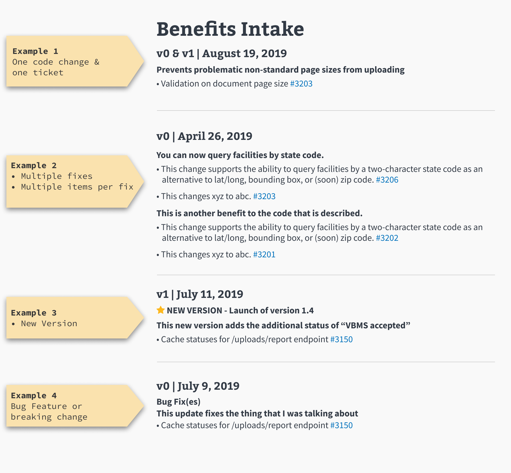

# Release Notes Instructions.
VA Lighthouse represents numerous APIs. Updates are made on a frequent basis, and it is our goal to share important updates with our users.

We want to ensure our Release Notes are impactful, informative, and understandable to the user in a relatable way. Release notes should be User-Centric; focus on HOW and WHY the change benefits our users and then describe WHAT has changed. Use plain language with as little jargon as possible when describing the benefit:

1. How does it benefit our users? Why was it changed?

2. Details around what was changed/fixed (followed by a link to the ticket if applicable).

#### Release notes should match the following format:

## MD FORMAT SAMPLE
`# Name of API`

`## API versionname(s) | Month 00, Year`

`### Bolded 
 level plain english description of benefit of the change`

`### • brief details on changes made with link to Github Issue  [#1111](https://github.com)`

## HTML TEXT SAMPLE
`# <h1>` Benefits Intake

`## <h2>` v0 & v1 | August 19, 2019

`### <bold>
` **Prevents problematic non-standard sizes from being uploaded**

`### 
` • Validation on document page size [#3212](https://github.com/department-of-veterans-affairs/vets-api/pull/3213)

## IMAGE SAMPLE

